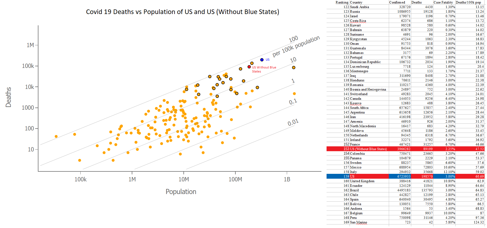

# Blue States had tremendous deaths

President Trump made a particular statement about Covid19 death rates that I saw people comment on saying it was obviously incorrect but I found no one that did any work determine it was in fact erroneous.

The statement : **"The blue states had tremendous death rates, if you take the blue states out we're at a level that I don't think anybody in the world would be at we're really at a very low level"**

## Data

Original Chart and Data for the List from Johns Hopkins University (link #1)
The US without Blue States point based on:

1. The New York Times summary of cases and deaths (link #2) 
2. The Wikipedia entry on states and territories for population(link 3 which gets it's numbers from link 4) 
3. An analysis/determination of what counts as "blue state" based on MIT's election lab historical voting dataset (link 5)

## What is a blue state

I considered two approaches for determining whether or not a state should be considered blue.

1. Count up all representatives that they selected starting with the 2000 election and tally based on each selection's party 
2. Collect the representatives as before but weigh their importance with a presidential vote being worth 1, each senator worth 1/2 and each member of the house 1/(# of representatives the state has)

I figured #2 would be more in line with the perception of the public since a presidential pick appears to be more representative of the state than any individual districts representative

Before weights I scored democrat as 0, republican as 1 and other as 0.5.

After summing over the weighted values I collected the states into 7 evenly sized bins. (0 to 1/7, 1/2 to 2/7, ..., 6/7 to 1) 
These were listed as : Heavily Democrat, Moderately Democrat, Slightly Democrat, No Party Preference, Slightly Republican, Moderately Republican, Heavily Republican

I then removed the following states based on their classification

Heavily Democrat: Connecticut, Hawaii, Maryland, Massachusetts, New York, Oregon, Rhode Island 	
Moderately Democrat: California, Delaware, Illinois, Maine, Minnesota, New Jersey, Vermont, Washington 	
Slightly Democrat : Michigan, New Hampshire, New Mexico, Wisconsin 	

### Difference between approach #1 and #2
Michigan and Wisconsin moved from No Party Preference in approach #1 to Slightly Democratic in approach #2.
Their combined result of Covid deaths has them contributing slightly more to the death rate than the average rate across the country so eliminating them is being cautious on the side of the president's claim.

## Result
I combined the population and covid deaths remaining states and territories (American Samoa, Guam, Northern Mariana Islands, Puerto Rico, U.S. Virgin Islands, Washington, D.C.)

The result was a popultaion of 187,727,066 with Covid19 deaths numbering 89199.  Which puts the US without Blue States at 47.52 deaths per 100,000. 
This is a lower death rate than the US as a whole, but it moves the US from 158th out of 168 countries with data at Johns Hopkins to 153rd out of 168 countries.

The claim "if you take the blue states out we're at a level that I don't think anybody in the world would be at" is egregiously false.

### Data Sources - Links

1. https://coronavirus.jhu.edu/data/mortality
2. https://www.nytimes.com/interactive/2020/us/coronavirus-us-cases.html
3. https://en.wikipedia.org/wiki/List_of_states_and_territories_of_the_United_States
4. https://www2.census.gov/programs-surveys/popest/tables/2010-2019/state/totals/nst-est2019-01.xlsx?#
5. https://electionlab.mit.edu/data
